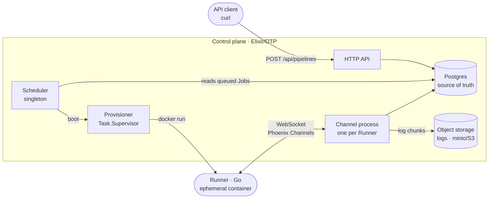
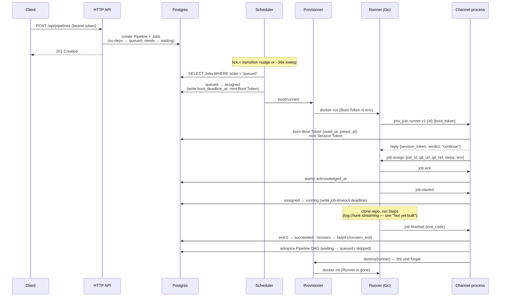
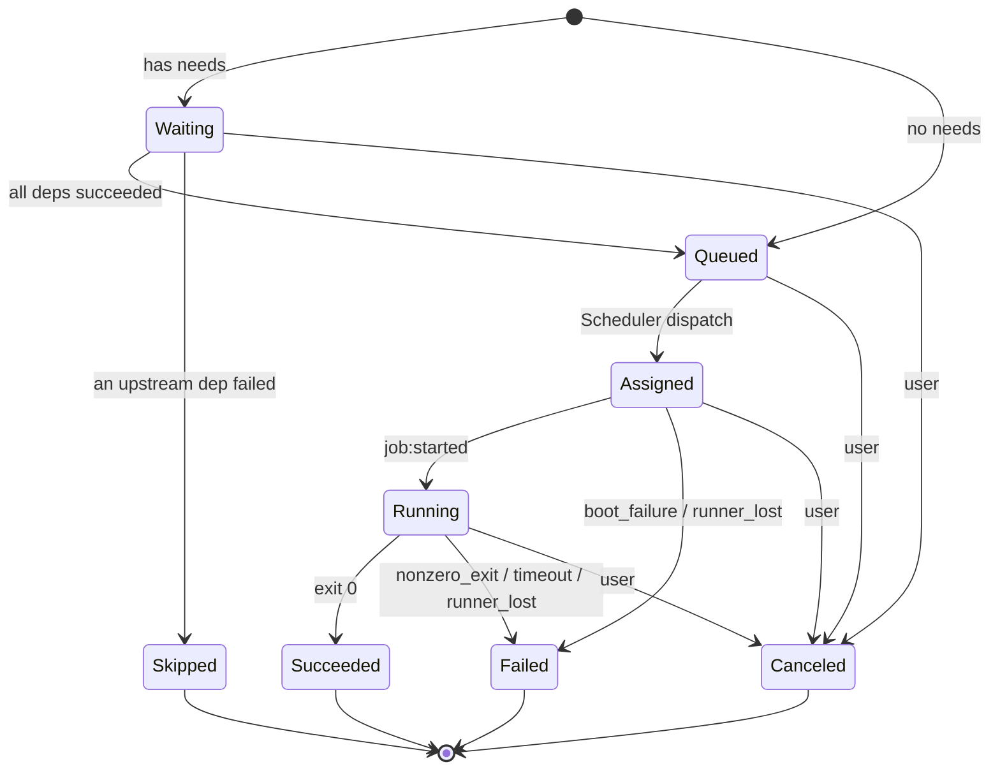

# System overview

This document traces how a Pipeline flows through Athanor end to end. It is the
synthesis that the ADRs and the supervision-tree doc give one decision at a
time — read it first for the whole picture, then follow the pointers for the
*why* behind any step.

Terms (Pipeline, Job, Runner, Provisioner, Boot Token, …) are defined in
[`../CONTEXT.md`](../CONTEXT.md). The wire-level contract is in
[`specs/runner-protocol.md`](specs/runner-protocol.md).

## The pieces

The control plane is one Elixir app; the only long-lived custom processes are
the **Scheduler** (a singleton GenServer) and the **Provisioner** (a
`Task.Supervisor`). Postgres owns all state — processes react to it but never
hold it (ADR 0002). Each Runner is a throwaway Docker container that exists for
exactly one Job (ADR 0003) and talks back over a persistent WebSocket using the
Phoenix Channels protocol (ADR 0001).

## The happy path

Key points the diagram compresses:

- **Dispatch is the only `queued → assigned` writer**, and the Scheduler is a
  singleton, so two dispatchers can never race over a Job. See
  [`supervision-tree.md`](supervision-tree.md).
- **The Boot Token is single-use.** It is minted on the Runner record at
  dispatch, presented once at first join, and burned (`boot_token_used_at`).
  Reuse/expiry/unknown all reject as a coarse `invalid_credentials`. Details and
  the derived TTL: [`specs/runner-protocol.md`](specs/runner-protocol.md).
- **`job:finished` carries facts, not a verdict.** The control plane derives
  succeeded/failed from `exit_code`; a non-zero exit becomes the `nonzero_exit`
  Failure Reason.
- **Runner teardown is fire-and-forget.** Destroying the container does not
  block the ack the protocol owes (ADR 0003).

## Job lifecycle

A Pipeline has no stored status — it is derived from its Jobs' states at read
time. Each Job moves through this machine (`AshStateMachine`, ADR 0002):

**Failed** is a single state; *why* it failed is a Failure Reason (data, not a
state): `nonzero_exit`, `timeout`, `runner_lost`, `boot_failure`. **Skipped** is
the verdict for an upstream dependency failing; **Canceled** is a user-initiated
stop reachable from any non-terminal state. See
[`../CONTEXT.md`](../CONTEXT.md) for the canonical definitions.

## Failure & recovery, in one sentence

Every timeout, hang, crash, or restart collapses into the same path: a deadline
written as a column expires, the next sweep notices, and the store-driven rule
re-queues or fails the Job — because no process owned anything to lose.
[`supervision-tree.md`](supervision-tree.md) covers boot timeouts, grace
periods, and what each process restart actually costs.

## Not yet built

The happy path above reflects what is implemented. These are specified in the
protocol PRD and reserved on the wire, but have no working consumer yet:

- **Rejoin with a Session Token** — the Session Token is minted and persisted,
  but the reconnect/state-resync path is not implemented (issue #10).
- **`log:chunk` streaming** — live log fan-out to object storage and PubSub
  tail (ADR 0004) is specified; the sender and handler are not built (issue #8).
- **`job:cancel`** — the control-plane cancel push and runner drain (issues
  #11, #55, #56).

When in doubt about built-vs-specified, the protocol spec marks each message;
this doc tracks its happy path.
